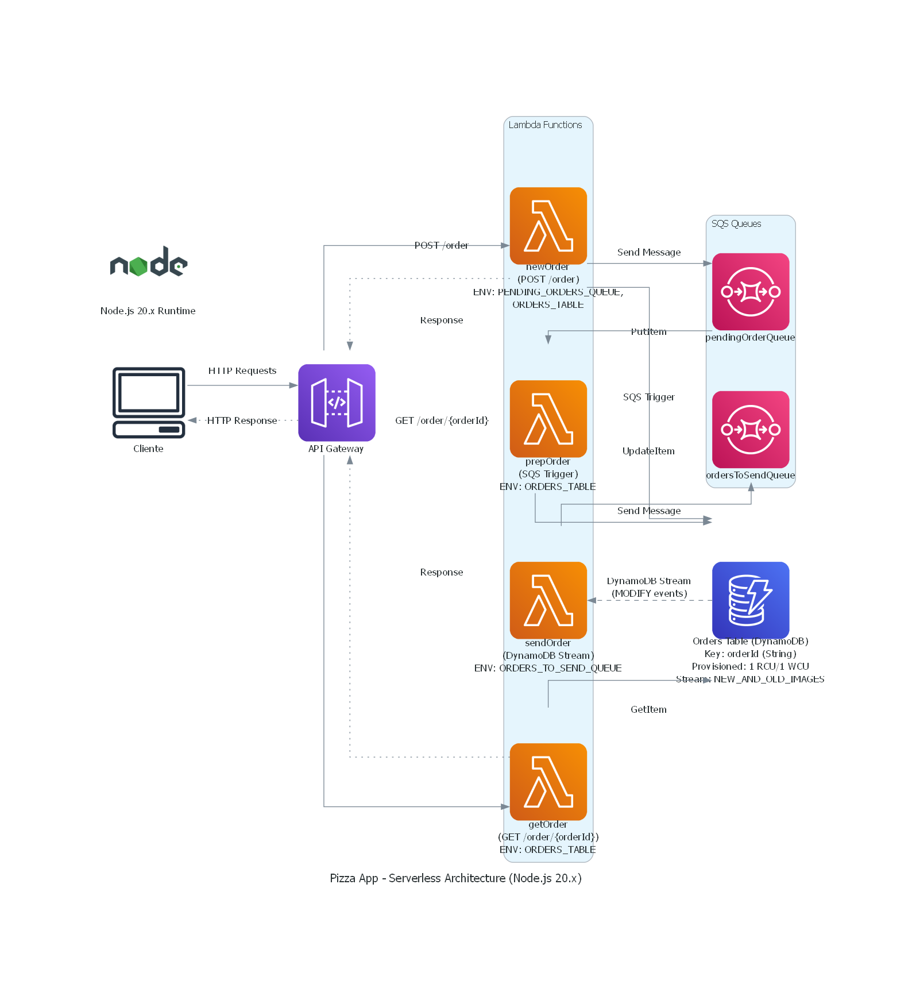
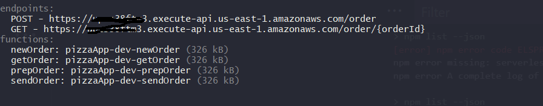
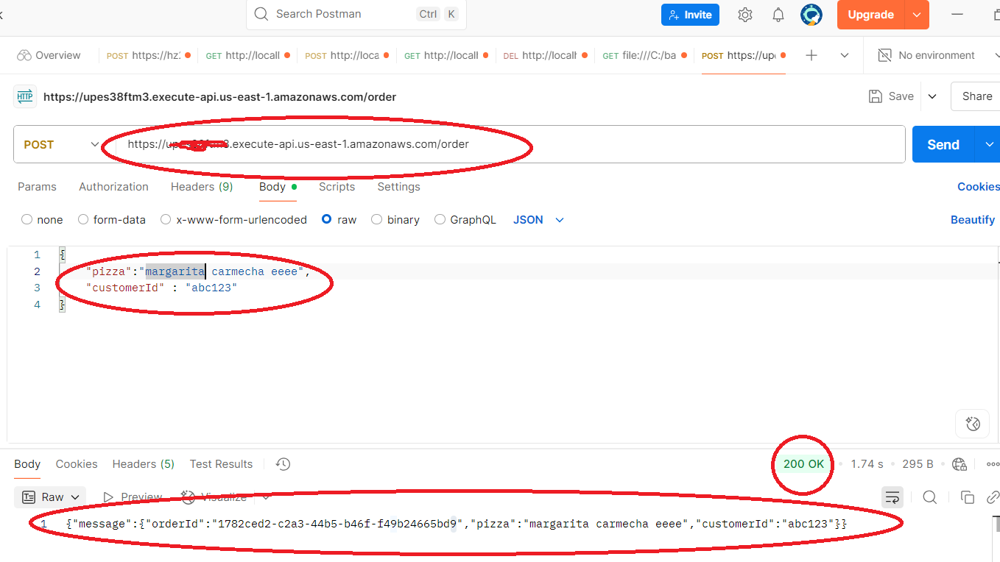
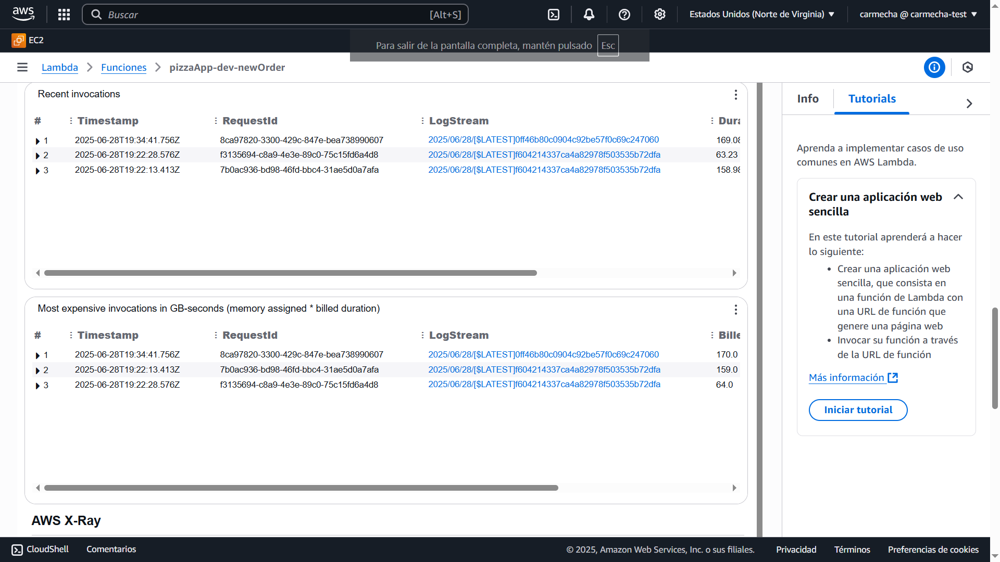
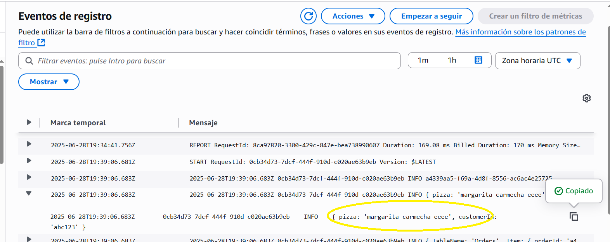
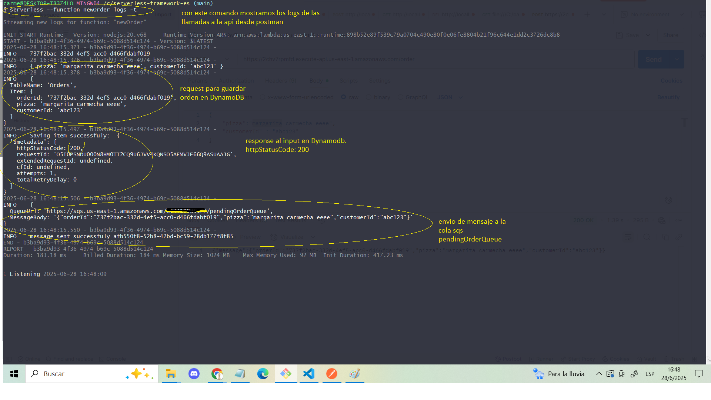

# serverless-framework-es


Sistema de pedidos en NodeJS para correr en AWS Lambda.

## 📄 Índice

- [Descripción](#descripción)
- [Arquitectura](#arquitectura) 
- [Tecnologías Utilizadas](#tecnologías-utilizadas)
- [Instalación](#instalación)
- [Uso](#uso)
- [Configuración AWS](#configuración-aws)
- [Contribuciones](#contribuciones)
- [Licencia](#licencia)

---

## 📝 Descripción #descripcion

Este proyecto implementa un sistema de pedidos desarrollado en Node.js, diseñado para desplegarse en AWS Lambda mediante Serverless Framework. Utiliza servicios clave de AWS como **API Gateway**, **SQS** (Simple Queue Service) y **DynamoDB** para gestionar las órdenes de manera escalable y sin servidor.

## 🏗️ Arquitectura





## 🚀 Tecnologías Utilizadas

* **Node.js**: Entorno de ejecución de JavaScript.
* **Serverless Framework**: Para el despliegue y gestión de aplicaciones sin servidor.
* **AWS Lambda**: Servicio de computación sin servidor.
* **Amazon API Gateway**: Para crear, publicar, mantener, monitorear y asegurar APIs a cualquier escala.
* **Amazon SQS (Simple Queue Service)**: Servicio de cola de mensajes para desacoplar componentes de aplicaciones.
* **Amazon DynamoDB**: Base de datos NoSQL completamente administrada.
* **DynamoDB Streams**: Para capturar un flujo ordenado de cambios a nivel de elemento en una tabla de DynamoDB.
* **AWS IAM (Identity and Access Management)**: Para gestionar el acceso a los servicios y recursos de AWS.

## ⚙️ Instalación

Sigue estos pasos para configurar y preparar el proyecto localmente:

1.  **Clona el repositorio:**

    ```bash
    git https://github.com/carmendiazit/serverless-framework-es.git
    cd serverless-framework-es
    ```

2.  **Verifica la versión de Node.js:**
    Asegúrate de tener Node.js instalado (se recomienda la versión 14 o superior):

    ```bash
    node -v
    ```
    Sino esta instalado 
    ```bash 
      npm install 

3.  **Instala el Framework Serverless globalmente:**

    ```bash
    npm install -g serverless
    ```

4.  **Configura tus credenciales de AWS:**
    Crea un archivo en `~/.aws/credentials` con tus claves de acceso. Reemplaza `TU_ACCESS_KEY_ID` y `TU_SECRET_ACCESS_KEY` con tus credenciales de AWS:

    ```ini
    [default]
    aws_access_key_id = TU_ACCESS_KEY_ID
    aws_secret_access_key = TU_SECRET_ACCESS_KEY
    ```

    * Puedes configurar las credenciales usando [AWS CLI](https://aws.amazon.com/cli/).*

5.  **Verifica la instalación de Serverless:**

    ```bash
    serverless -v
    ```

6.  **Verifica los archivos imprescindibles:**
    Asegúrate de que los siguientes archivos estén presentes en la raíz del repositorio:
    * `serverless.yml`
    * `package.json`
    * `handler.js`

## 🚀 Uso

### Despliegue del sistema

Para desplegar el sistema en AWS utilizando Serverless Framework, ejecuta el siguiente comando desde la raíz del proyecto:

```bash
serverless deploy
```
Luego de desplegar el proyecto se visualizan los endpoints y las funciones disponibles para cada uno.




- Sino no visualizas la info de arriba podes usar el 
```bash
serverless info
```
- Estos endpoints estan disponibles para probar desde postman u otros thunder client, chrome etc.
(en el ejemplo se visualiza el request POST al endpoint q invoca a la funcion newOrder en el archivo handler )




#### Desde CloudFormation - Nuestra pila - Recursos - Lambda  existe logsGroups o Eventos de registro, donde se pueden visualizar, las llamadas a nuestras funciones expuestas en el handler.







#### Desde la terminal loguamos la funcion  newOrder, nos muestra los request ya ejecutados
```bash
serverless --function newOrder logs 

```


#### Desde la terminal logueamos la funcion  newOrder, nos muestra los requests que se estan ejecutando, se queda listening logs.
```bash
serverless --function newOrder logs -t
```


### Eliminación el stack 
#### Para eliminar completamente el stack y todos los recursos asociados de AWS:
```bash
serverless remove
```
## ☁️ Configuración AWS
### Este proyecto hace uso de los siguientes servicios de Amazon Web Services:

* `AWS Lambda: Para la ejecución de las funciones sin servidor.`
* `Amazon API Gateway: Como punto de entrada para las APIs REST.`
* `Amazon SQS: Para la gestión de colas de mensajes, asegurando un procesamiento asíncrono y resiliente.`
* `Amazon DynamoDB: Como base de datos NoSQL para almacenar la información de los pedidos.`
* `DynamoDB Streams: Para reaccionar a los cambios en la base de datos de DynamoDB.`
* `AWS IAM: Para la gestión de permisos y roles de los recursos.`

## 🤝 Contribuciones
### ¡Las contribuciones son bienvenidas! Si deseas contribuir a este proyecto, por favor:

`Haz un "fork" del repositorio.`
`Crea una nueva rama (git checkout -b feature/AmazingFeature).`
`Realiza tus cambios y commitea (git commit -m 'Add some AmazingFeature').`
``Sube tus cambios (git push origin feature/AmazingFeature).`
`Abre un "Pull Request".`

## 🤝 Agradecimientos y contribuciones 

`@MarciaVillalba Marcia Villalba`

`@LauraBolaños Laura Bolaños`

## 📄 Licencia
Este proyecto está bajo la Licencia MIT. Consulta el archivo LICENSE para más detalles.


